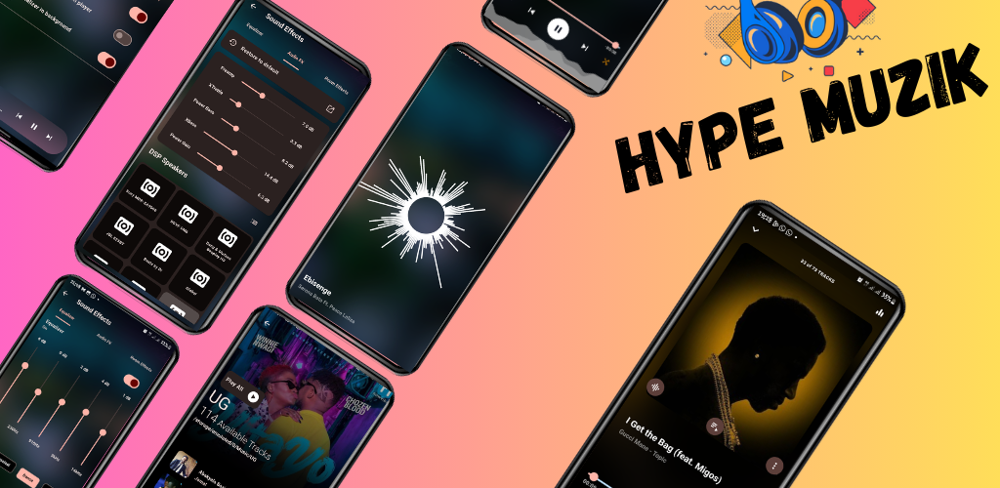

# Hype Muzik

[](LICENSE)

## Overview

Hype Muzik is a feature-rich audio customization app that allows you to tailor your audio experience to your preferences. Whether you're a music enthusiast, audiophile, or casual listener, Hype Muzik offers a range of powerful audio effects, equalizer controls, and more to enhance your listening pleasure.



## Features

- **Customized Audio:** Customize your audio experience with built-in audio effects and a powerful DSP engine.

- **Audio Presets:** Create and save your unique audio presets for different genres, moods, and occasions.

- **Equalizer Control:** Fine-tune every aspect of your sound, from bass to treble, to suit your preferences.

- **Immersive 3D Audio:** Immerse yourself in lifelike 3D soundscapes for a truly immersive experience.

- **Library Organization:** Effortlessly organize your music library with powerful library scanning and sorting features.

- **Cross-Platform Compatibility:** Enjoy your customized audio experience across all your devices.

## Installation

To get started with Hype Muzik, follow these steps:

1. Clone the repository:

```
   git clone https://github.com/yourusername/hype-muzik.git
```

# Release Notes - Version v1.0.3

## 🎉 New Features & Enhancements 🎉

`Customized Feedback`: We've listened to your feedback and added a brand new feature in Hype Muzik that allows you to customize your audio experience. Tailor the sound to your liking, whether you're a music enthusiast, audiophile, or casual listener.

`Audio DSP Engine`: Introducing a powerful audio Digital Signal Processing (DSP) engine in Hype Muzik that takes your sound quality to the next level. Get ready for unparalleled audio performance.

`Powerful Library Scan`: We've revamped our library scanning functionality in Hype Muzik to make it faster and more efficient than ever. Easily find and organize your music library with lightning speed.

## 🔊 Audio Excellence 🔊

Our commitment to delivering top-notch audio quality in Hype Muzik remains unwavering. Enjoy crystal-clear sound, deep bass, and immersive 3D audio across all your devices.
## 🚀 Performance Improvements 🚀

We've fine-tuned Hype Muzik's performance to ensure a smoother and more responsive user experience.
🛠️ Bug Fixes 🛠️

We've squashed some pesky bugs in Hype Muzik to make your audio customization experience even better.
📦 General Updates 📦

We've made various behind-the-scenes improvements and optimizations in Hype Muzik to keep your app running at its best.
📩 Feedback & Support 📩

Your feedback is essential to us. If you have any questions, suggestions, or encounter any issues in Hype Muzik, please reach out to our support team. We're here to help!

 🚀 ***Thank you for choosing Hype Muzik***🚀

We're dedicated to providing you with the best audio customization experience possible in Hype Muzik. Stay tuned for more exciting updates and enhancements in future releases.

